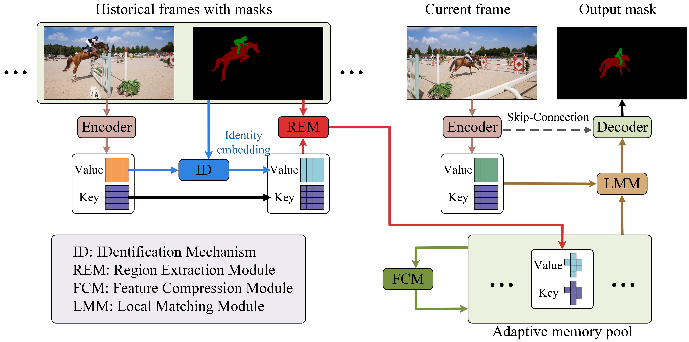

# AMN
 A semi-supervised object segmentation method by using adaptive memory network



## REM: Region Extraction Module
REM extracts the features of objects by focusing on the object area and filtering out background information.

#### Build Extensions
```
cd /extensions//reg_att_map_generator
python setup.py install --user
```
#### A Example
```
from extensions.reg_att_map_generator import RegionalAttentionMapGenerator

self.ram = RegionalAttentionMapGenerator()

att_map, bbox = self.ram(curr_mask, n_object)
```
#### Advantage
 The features of all objects are encapsulated in a single feature map containing the salient information, significantly reducing the number of features that need to be stored.
## ID:  IDentification Mechanism
ID enables the integration of multiple-object features within a unified feature space.
## FCM: Feature Compression Module
FCM compresses the outdated features into the feature containing the salient information.
## LMM: Local Matching Module
LMM enhances segmentation speed and accuracy through local matching between the query feature of the current frame and the key features of the memoried historical frames.
## Some useful work for our paper
**AOT**: <https://github.com/z-x-yang/AOT>
**RMNet**: <https://github.com/hzxie/RMNet>
